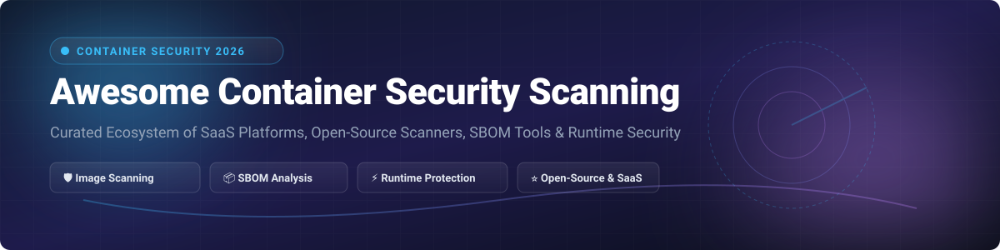

# 🛡️ Awesome Container Security Scanning

   

> **Curated ecosystem of Container Vulnerability Scanners, Software Bill of Materials (SBOM) generators, Container Registry Enforcers, and Cloud-Native Runtime Security Tools.**

---

## 📑 Table of Contents
- [🌐 SaaS & Commercial Hosted Platforms](#-saas--commercial-hosted-platforms)
- [💻 Open-Source Container Security Tools](#-open-source-container-security-tools)
- [🤝 How to Contribute](#-how-to-contribute)
- [💖 Support & Community](#-support--community)
- [⚠️ Disclaimer & Field Insights](#%EF%B8%8F-disclaimer--field-insights)
- [📈 Star History](#-star-history)

---

## 🔍 Market Context & Overview

> 📊 **Estimated Market Size & Structure**: The Container & Cloud-Native Security market is projected at **~$2.5B–$3.2B**, expanding rapidly alongside Kubernetes adoption. The sector is **moderately fragmented**: while hyper-scaler CNAPP vendors dominate broad enterprise suites, specialized open-source engines (**Trivy**, **Grype/Syft**) form the foundational core layer used across CI/CD and registry scanning pipelines.

---

## 🌐 SaaS & Commercial Hosted Platforms

| Product Name 🚀 | Market Scale & Size 🏢 | Pricing (Starting Tier) 💵 | Free Tier / Free Trial Limits 🎁 | Key Differentiators & Description 🛡️ |
| :--- | :--- | :--- | :--- | :--- |
| **[Palo Alto Prisma Cloud](https://www.paloaltonetworks.com/prisma/cloud)** | Public (PANW), ~$312B Mkt Cap, $11.48B Rev | $90 / credit / year (Overage base pricing) | 30-day Free Trial with 100 enterprise credits limit | Enterprise CNAPP providing continuous container image scanning, K8s CIS benchmarks, and CRI-O runtime mapping. |
| **[Qualys Container Security](https://www.qualys.com/)** | Public (QLYS), ~$5.2B Mkt Cap, $600M Rev | $995 / year (Qualys Express starter tier) | 30-day Free Trial up to 50 assets / container images | Cloud security platform offering full vulnerability management, policy compliance, and CI/CD container integration. |
| **[Tenable Cloud Security](https://www.tenable.com/)** | Public (TENB), ~$4.8B Mkt Cap, $850M Rev | $2,275 / year (Tenable.io 65-asset starter tier) | 30-day Free Trial for up to 65 assets | Comprehensive container vulnerability assessment and Kubernetes infrastructure posture management. |
| **[Snyk Container](https://snyk.io/product/container-vulnerability-management/)** | Private (~$7.4B valuation), ~$300M ARR | $25 / developer / month (Team Plan) | Free Forever: 100 container tests / month | Developer-first scanning with automated base image remediation recommendations (e.g., `node:16` → `node:16-alpine`) and K8s manifest security checks. |
| **[Aqua Security](https://www.aquasec.com/)** | Private (~$3.4B valuation), ~$150M ARR | $300 / month (Aqua SaaS Team plan starting tier) | 14-day Free Trial with full enterprise scanner features | Comprehensive CNAPP covering image scanning, MalwareScan engine, and hybrid userspace/kernel eBPF Aqua Enforcers. |
| **[Sysdig Secure](https://sysdig.com/)** | Private (~$2.5B valuation), ~$100M ARR | $90 / host / month (Sysdig Secure Pro) | 30-day Free Trial for up to 5 hosts / 50 containers | eBPF-driven runtime security & container forensics built by creators of Falco; matches image vulnerabilities with active runtime context. |
| **[Docker Scout](https://docs.docker.com/scout/)** | Private (Docker Inc., ~$2.1B valuation) | $9 / developer / month (Docker Team plan) | Free Forever: 1 repository continuous analysis + 3 Docker Hub repositories | Docker-native CLI & Desktop scanner offering PURL-based advisory matching and base-image vulnerability upgrade recommendations. |
| **[Anchore Enterprise](https://anchore.com/)** | Private (~$150M valuation, ~$25M ARR) | $15,000 / year (Enterprise Base Tier) | 14-day Enterprise Free Trial | Enterprise governance built on Syft & Grype; adds policy-as-code gates, audit-ready compliance reporting, and SBOM management. |
| **[SUSE NeuVector](https://www.suse.com/)** | Enterprise SUSE Subsidiary | Included in SUSE Rancher Prime ($1,200/node/yr) | Free Forever Open Source (Community Edition Apache 2.0) | Full-lifecycle container security platform providing zero-trust runtime protection, network inspection, and CIS compliance benchmarks. |

---

## 💻 Open-Source Container Security Tools

Open-source tools form the core scanner ecosystem. Below is a curated list sorted by **GitHub Star Count (Descending)**:

1. ⭐ **[Trivy](https://github.com/aquasecurity/trivy/stargazers)** 
   
   - **Focus**: All-in-one Container, FileSystem, Git, IaC, and Kubernetes Scanner.
   - **Description**: The default open-source scanner in cloud-native DevOps. Scans OS packages (Debian, Alpine, RHEL) and language dependencies, generates SPDX/CycloneDX SBOMs, and filters false positives using distro-provided patch advisories.
   - **License**: Apache 2.0

2. ⭐ **[Grype](https://github.com/anchore/grype/stargazers)** 
   
   - **Focus**: Fast, privacy-conscious vulnerability scanner for container images & SBOMs.
   - **Description**: Designed for SBOM-first workflows. Pairs seamlessly with Syft to scan generated SBOMs repeatedly without needing to pull container images again. Supports EPSS, KEV, and OpenVEX filtering.
   - **License**: Apache 2.0

3. ⭐ **[Clair](https://github.com/quay/clair/stargazers)** 
   
   - **Focus**: Registry-embedded static container image analyzer.
   - **Description**: API-driven engine performing layer-by-layer static analysis. Embedded natively into registries (such as Quay and Harbor) to automatically audit container images upon push.
   - **License**: Apache 2.0

4. ⭐ **[Syft](https://github.com/anchore/syft/stargazers)** 
   
   - **Focus**: High-accuracy Software Bill of Materials (SBOM) generator CLI.
   - **Description**: Industry leader in SBOM accuracy (96% component completeness). Deep cataloging across Node, Python, Java, Go, and Rust dependencies in SPDX, CycloneDX, and Syft JSON formats.
   - **License**: Apache 2.0

5. ⭐ **[Dockle](https://github.com/goodwithtech/dockle/stargazers)** 
   
   - **Focus**: Container Image Linter & CIS Security Benchmark Enforcer.
   - **Description**: Audits container image build best practices (e.g., checking for root users, missing healthchecks, credentials stored in layers, and CIS benchmarks) to ensure secure Dockerfile execution.
   - **License**: MIT

6. ⭐ **[Container Structure Test](https://github.com/GoogleContainerTools/container-structure-test/stargazers)** 
   
   - **Focus**: Structural validation framework for container images by Google.
   - **Description**: Provides a declarative framework to validate the structure of container images, including command execution checks, file existence checks, content matching, and metadata verification.
   - **License**: Apache 2.0

7. ⭐ **[Jacked](https://github.com/carbonetes/jacked/stargazers)** 
   
   - **Focus**: Lightweight CLI container scanner with CycloneDX engine.
   - **Description**: Simple CLI tool for scanning images and directories with customizable severity pass/fail CI criteria (`--fail-criteria high`).
   - **License**: Apache 2.0

8. ⭐ **[Drydock](https://github.com/hiro-o918/drydock/stargazers)** 
   
   - **Focus**: Google Cloud Artifact Registry Container Vulnerability Auditor.
   - **Description**: Lightweight CLI fetching vulnerability data directly from Google Cloud Container Analysis API, enabling fixable-only filtering and clean output for GCP native stacks.
   - **License**: MIT

9. ⭐ **[Argus Security](https://github.com/huntridge-labs/argus/stargazers)** 
   
   - **Focus**: Unified Multi-Scanner CLI with AI & MCP support.
   - **Description**: Orchestrates 14+ scanners (Trivy, Grype, Syft, Gitleaks, Bandit, CodeQL) behind a single interface with Model Context Protocol (MCP) support for AI coding assistants.
   - **License**: AGPL-3.0

---

## 🤝 How to Contribute

1. 🍴 **Fork** the repository.
2. 📝 **Add/edit entries** in `README.md` following the tabular or ranked open-source format.
3. 📌 Ensure entries include exact project URLs, clear security descriptions, and factual details.
4. 🚀 Submit a **Pull Request** with a brief summary of the proposed addition!

---

## 💖 Support & Community

If you find this curated container security list helpful, please consider supporting the project:

- ⭐ **Star** this repository on GitHub to boost visibility for platform & DevSecOps engineers.
- 🔀 **Fork** and share it with your DevSecOps team and community.
- ☕ **Buy Me a Coffee / Sponsor**: Support ongoing maintenance on the [GitHub Sponsor Dashboard](https://github.com/sponsors/ishandutta2007).

---

## ⚠️ Disclaimer & Field Insights

- This is a **community-curated list** provided for educational and evaluation purposes.
- **Detection layer is solved by Open Source**: Production-grade tools like **Trivy** and **Grype** offer high-speed, free vulnerability scanning with exceptional accuracy.
- **Commercial SaaS value**: Lies primarily in triage reduction, runtime reachability correlation, automated ticket generation, VEX management, and enterprise compliance reporting.

---

## 📈 Star History

---

**Made with ❤️ for Platform Engineers, DevSecOps Architects, and Cloud Security Teams.**
